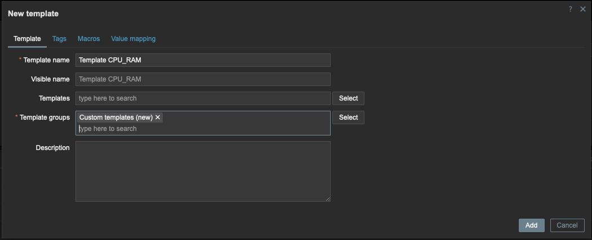

# zabbix-practice-2

---

## Задание 1. Создание собственного шаблона

**Задание:**  
Создайте свой шаблон, в котором будут элементы данных, мониторящие загрузку CPU и RAM хоста.

**Решение:**

1. Создан шаблон **Template CPU_RAM** в **Data collection → Templates**:  
   
