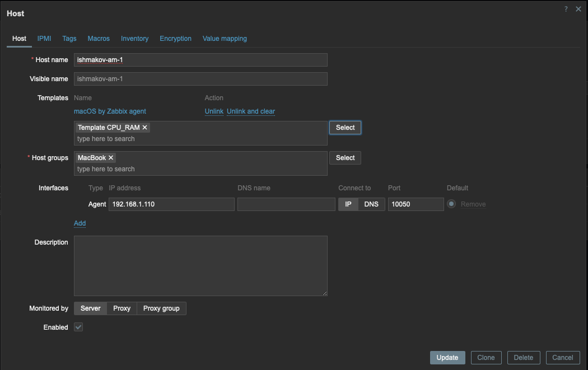

# zabbix-practice-2

---

## Задание 1. Создание собственного шаблона

**Задание:**  
Создайте свой шаблон, в котором будут элементы данных, мониторящие загрузку CPU и RAM хоста.

**Решение:**

1. Создан шаблон **Template CPU_RAM** в **Data collection → Templates**:  
   

2. Элемент данных для CPU (ключ `system.cpu.util[,user]`):
   

3. Элемент данных для RAM:
   

---

## Задание 2. Добавление двух хостов

**Задание:**  
Добавьте в Zabbix два хоста и задайте им имена ishmakov-am-1 и ishmakov-am-2.

**Решение:**
1. Переименованы хосты:
   

---

## Задание 3. Привязка шаблонов к хостам

**Решение:**

1. Привязка шаблонов к `ishmakov-am-1`:  
   

2. Привязка шаблонов к `ishmakov-am-2`:  
   

## Задание 4. Кастомный дашборд

**Решение:**

